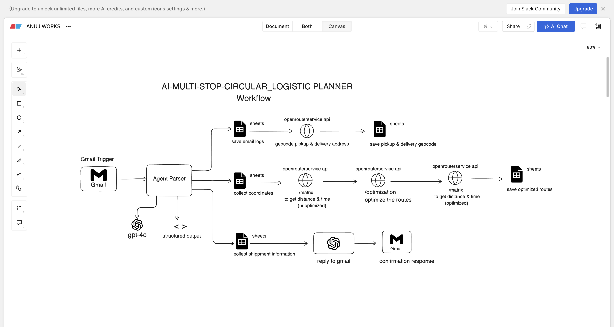

# Logistics Planner

AI-powered logistics route optimizer that turns inbound Gmail requests into optimized pickup/delivery schedules, stores an audit trail in Google Sheets, and sends HTML confirmation replies.

## Workflow Overview



## What It Does

The system automates the entire logistics workflow:

1. **Ingest** - Polls Gmail for unread pickup/delivery requests
2. **Parse** - Extracts structured data (stops, addresses, times) using GPT-4o
3. **Geocode** - Converts addresses to GPS coordinates via OpenRouteService (Pelias)
4. **Optimize** - Runs VROOM optimization with pickup-delivery pairing and time windows
5. **Compare** - Calculates savings using ORS matrix API (original vs. optimized)
6. **Log** - Stores full audit trail in Google Sheets
7. **Reply** - Sends HTML confirmation email with route summary and savings

## Live Example

### Step 1: Incoming Pickup Request

The pipeline triggers on unread Gmail messages with pickup schedules:


### Step 2: Optimized Route Confirmation

After optimization, an HTML reply is sent with the optimized sequence, ETAs, and savings:


Some stops are rejected due to time window constrains , which sent back to retailer via gmail.

### Step 3: Google Sheets Audit Trail

All data is logged to Google Sheets for tracking and analysis:


## Pipeline Architecture

Built with LangGraph, the pipeline flows through these nodes:

| Node | Description |
|------|-------------|
| `gmail_trigger` | Create request ID (`REQ-YYYYMMDD-<hash>`), check duplicates |
| `parser_agent` | Extract sender info, stops, addresses using GPT-4o |
| `save_email_logs_to_sheet` | Log raw email and parsed stops to Sheets |
| `geocode_pickup_delivery_address` | Geocode addresses with elevation lookup |
| `route_optimization` | Run ORS VROOM optimization with shipments mode |
| `matrix_unoptimized` | Compute baseline distance/duration for original stop order |
| `ai_agent_reply` | Generate HTML email with route tables and savings |
| `send_reply_to_gmail` | Send threaded reply via Gmail API |
| `error_handler` | Log failures to `error_log` sheet |

## Repository Structure

```
.
├── agent.ipynb                 # Main LangGraph pipeline (entry point)
├── auth_setup.py               # One-time Google OAuth setup
├── requirements.txt            # Python dependencies
├── tools/
│   ├── gmail_tools.py          # Gmail API wrappers
│   ├── sheets_tools.py         # Google Sheets logging
│   └── ors_tools.py            # OpenRouteService tools (geocode, matrix, optimize)
└── credentials/
    ├── credentials.json        # Google OAuth client (download from GCP)
    └── token.json              # Generated OAuth token
```

## Setup

1. **Create virtual environment**
   ```bash
   python -m venv venv
   source venv/bin/activate
   ```

2. **Install dependencies**
   ```bash
   pip install -r requirements.txt
   ```

3. **Configure environment variables** (`.env`)
   ```
   OPENAI_API_KEY=sk-...
   ORS_API_KEY=...
   GOOGLE_SHEET_ID=...
   DEPOT_LATITUDE=...
   DEPOT_LONGITUDE=...
   ```

4. **Google OAuth setup**
   - Download OAuth client JSON as `credentials/credentials.json`
   - Run `python auth_setup.py` to generate `credentials/token.json`

5. **Run**
   - Open `agent.ipynb` and execute cells in order
   - The last cell starts the Gmail polling loop

## Environment Variables

| Variable | Description |
|----------|-------------|
| `OPENAI_API_KEY` | OpenAI API key for GPT-4o parser |
| `ORS_API_KEY` | OpenRouteService API key |
| `GOOGLE_SHEET_ID` | Google Sheet ID for logs |
| `DEPOT_LATITUDE` | Depot starting latitude |
| `DEPOT_LONGITUDE` | Depot starting longitude |
| `MAX_VEHICLES` | Max fleet size (default: 5) |
| `VEHICLE_CAPACITY` | Capacity units per vehicle (default: 100) |
| `GMAIL_QUERY` | Gmail search query (default: `is:unread subject:Pickup Schedule`) |

## Google Sheets Tabs

| Tab | Contents |
|-----|----------|
| `email_log` | Raw email metadata |
| `parsed_stops` | Extracted stops from LLM |
| `geocoded` | GPS coordinates with elevation |
| `route_output` | Optimized routes, ETAs, savings |
| `error_log` | Failed requests with error codes |

## Route Optimization

The optimization uses a three-step approach:

1. **Baseline** - ORS `/matrix` computes distance/duration for original stop order
2. **VROOM** - ORS `/optimization` with shipments mode enforces pickup-before-delivery, time windows, vehicle capacities
3. **Optimized** - ORS `/matrix` computes distance/duration for VROOM-ordered sequence

Both matrix calls use `driving-hgv` profile for truck routing.

## Troubleshooting

| Issue | Solution |
|-------|----------|
| Gmail access fails | Re-run `python auth_setup.py` to refresh token |
| ORS geocoding fails | Verify `ORS_API_KEY` has quota |
| Sheets write fails | Check `GOOGLE_SHEET_ID` and edit permissions |
| No reply sent | Check `error_log` sheet for error codes |
| Duplicate detected | Resending same email is skipped by design |

## Roadmap

- [ ] Support Gmail attachments (`.csv`, `.xlsx`)
- [ ] Migrate from notebook to modular package structure
- [ ] Priority-based route optimization
- [ ] Elevation-aware routing
- [ ] Dynamic vehicle count optimization
