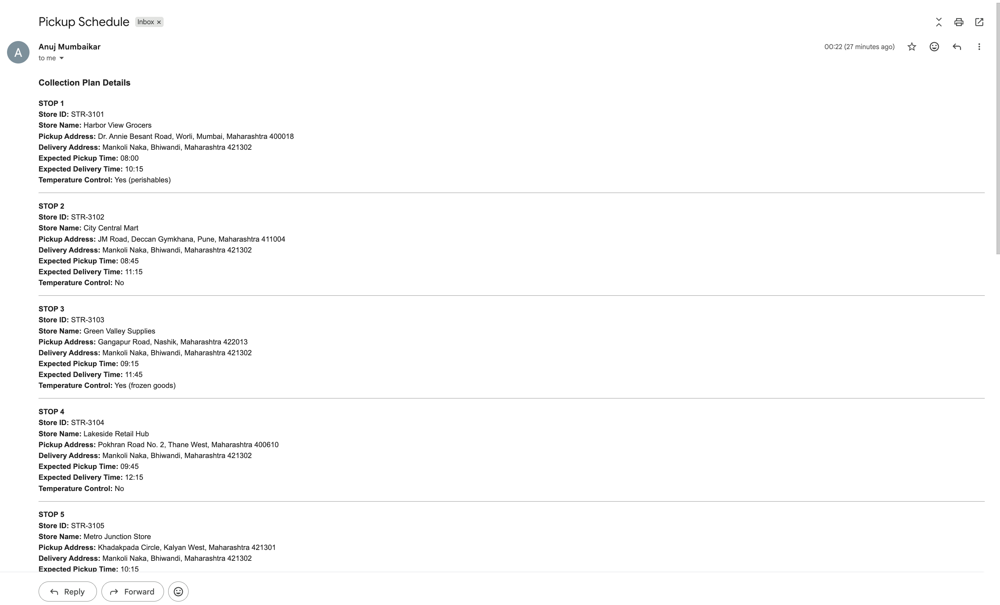
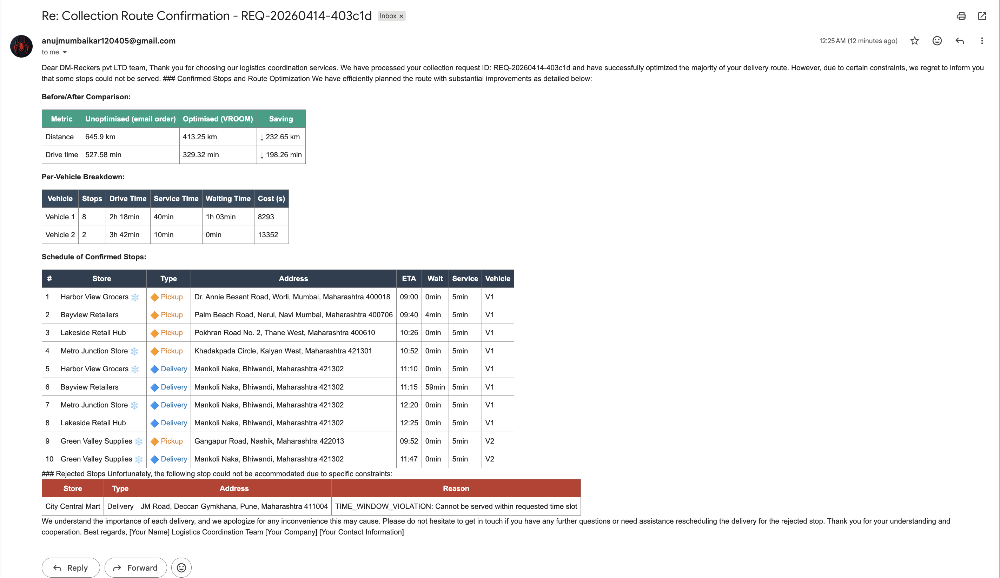

# Logistics Planner

AI-powered logistics route optimizer that turns inbound Gmail requests into optimized pickup/delivery schedules, stores an audit trail in Google Sheets, and sends HTML confirmation replies back to the sender.

## What It Does

The system ingests unread Gmail messages, extracts structured pickup/delivery data with GPT-4o, geocodes addresses using OpenRouteService (Pelias), optimizes routes using ORS VROOM with pickup-delivery pairing, compares original vs. optimized distance/time using ORS matrix API calls, logs results to Google Sheets, and sends threaded HTML reply emails with route summaries and savings comparisons.

## Workflow

The main workflow lives in [agent.ipynb](agent.ipynb). It is built as a LangGraph pipeline with these nodes:

1. `gmail_trigger` - Create a `REQ-YYYYMMDD-<6-char hash>` request ID and check for duplicates.
2. `parser_agent` - Use GPT-4o to extract sender info, company name, and pickup/delivery stops from the email body.
3. `save_email_logs_to_sheet` - Save the raw email and parsed stops to Google Sheets `email_log` and `parsed_stops` tabs.
4. `geocode_pickup_delivery_address` - Geocode both pickup and delivery addresses with elevation lookup; save to `geocoded` tab.
5. `route_optimization` - Calculate unoptimized baseline via ORS `/matrix`, run ORS VROOM `/optimization` with shipments mode, calculate optimized metrics via `/matrix`.
6. `matrix_unoptimized` - Compute baseline distance/duration for original email stop order using ORS matrix API.
7. `ai_agent_reply` - Generate HTML confirmation email with route tables, vehicle breakdowns, and before/after savings comparison.
8. `send_reply_to_gmail` - Send the HTML reply in the original Gmail thread.
9. `error_handler` - Log failures to the `error_log` sheet.

### Route Optimization Deep Dive

The route optimization follows a three-step pattern:

1. **Baseline measurement** - ORS `/v2/matrix/driving-hgv` computes distance/duration for the original email stop order.
2. **VROOM optimization** - ORS `/optimization` with shipments mode enforces pickup-before-delivery constraints, time windows, and vehicle capacities.
3. **Optimized measurement** - ORS `/matrix` computes distance/duration for the VROOM-ordered sequence.

Both matrix calls use the `driving-hgv` profile for truck routing. The savings comparison (original vs. optimized km and minutes) is included in the confirmation email.

### State Management

The LangGraph state (`LogisticsState`) tracks:

- **Email context**: raw content, sender email, thread ID, request ID
- **Parsed data**: stops list, sender company, rejected stops
- **Geocoding**: latitude/longitude for pickup and delivery addresses
- **Optimization**: vehicle count, VROOM summary, routes, ordered stops
- **Matrix results**: unoptimized and optimized distance/duration legs
- **Output**: reply HTML, email log saved flag, error messages

## Workflow in Action

### Step 1: Incoming Pickup Request Email

The pipeline starts by polling Gmail for unread emails matching the collection request query. A user sends a structured email with pickup stops:

The email contains stop details including store ID, pickup address, delivery address, expected times, and temperature control requirements.

### Step 2: Automated Route Optimization & Confirmation Reply

Once parsed and geocoded, the pipeline optimizes the route using ORS VROOM and sends back an HTML confirmation email with an interactive table showing the optimized sequence, ETAs, and route summary:

The reply includes:
- Optimized stop sequence with ETAs
- Original vs. optimized distance/time savings
- Stop details (Store ID, Pickup/Delivery addresses, Cold Chain flags)

### Step 3: Audit Trail in Google Sheets

All request data, geocoding results, and optimized routes are logged to the `route_output` Google Sheets tab for auditing and analysis:

The sheet captures:
- Request ID and optimized sequence
- Store metadata (ID, name, addresses)
- GPS coordinates and ETAs
- Total distance and duration
- Temperature control flags

## Repository Layout

- [agent.ipynb](agent.ipynb) - Jupyter notebook containing the full LangGraph pipeline, state definition, and runtime entry point.
- [tools/gmail_tools.py](tools/gmail_tools.py) - Gmail API wrappers: `poll_gmail_inbox()` and `send_gmail_reply()` as LangChain tools.
- [tools/sheets_tools.py](tools/sheets_tools.py) - Google Sheets logging: email logs, parsed stops, geocoded data, route output, error logs, and duplicate detection.
- [tools/ors_tools.py](tools/ors_tools.py) - OpenRouteService tools: `geocode_address()`, `elevation_point()`, `optimize_route()`, and `distance_matrix()`.
- [auth_setup.py](auth_setup.py) - One-time Google OAuth setup that creates `credentials/token.json`.
- [requirements.txt](requirements.txt) - Python dependencies.

## Requirements

- Python 3.13 or compatible virtual environment
- Google OAuth credentials in `credentials/credentials.json`
- Google token file in `credentials/token.json`
- `OPENAI_API_KEY`
- `ORS_API_KEY`
- `GOOGLE_SHEET_ID`

## Setup

1. Create and activate a virtual environment.
2. Install dependencies with `pip install -r requirements.txt`.
3. Add a `.env` file with the required environment variables.
4. Download your Google OAuth client JSON and save it as `credentials/credentials.json`.
5. Run `python auth_setup.py` once to create `credentials/token.json`.

## Environment Variables

The notebook and helper modules read these variables from `.env`:

- `OPENAI_API_KEY` - OpenAI API key for GPT-4o parser and reply generation.
- `ORS_API_KEY` - OpenRouteService API key for geocoding, elevation, matrix, and VROOM optimization.
- `GMAIL_POLL_INTERVAL` - Gmail polling interval in seconds (default: `60`).
- `GMAIL_QUERY` - Gmail search query (default: `is:unread subject:Pickup Schedule`).
- `GOOGLE_TOKEN_PATH` - OAuth token path (default: `credentials/token.json`).
- `GOOGLE_SHEET_ID` - Google Sheet ID for logs and route output.
- `DEPOT_LATITUDE` - Depot/warehouse starting latitude for route optimization.
- `DEPOT_LONGITUDE` - Depot/warehouse starting longitude for route optimization.
- `MAX_VEHICLES` - Maximum fleet size for VROOM optimization (default: `5`).
- `VEHICLE_CAPACITY` - Capacity units per vehicle (default: `100`).

## Google Sheets Tabs

The Sheets integration writes to these tabs:

- `email_log` - raw email metadata per request
- `parsed_stops` - extracted stops from the LLM parser
- `geocoded` - pickup and delivery GPS coordinates with elevation
- `route_output` - optimized route with sequences, ETAs, totals, and savings context
- `error_log` - failed requests with error codes

## Running The App

Open [agent.ipynb](agent.ipynb) and execute the cells in order. The last notebook cell starts the polling loop and continuously checks Gmail for new requests.

The helper scripts can also be run directly:

- `python auth_setup.py` - create the Google OAuth token.
- `python tools/ors_tools.py` - run ORS helper examples.

## Implementation Notes

- The route optimization uses `driving-hgv`, not a passenger car profile.
- The pipeline is now linear, not fan-out based.
- Duplicate requests are skipped by checking the generated request id against the email log.
- Original and optimized route metrics are both calculated with ORS `/matrix`.
- Both pickup and delivery addresses are geocoded, but only pickup addresses are used for optimization.
- The reply email is built from an HTML route table plus a summary of original distance, optimized distance, and savings.

## Troubleshooting

- **Gmail access fails**: Verify `credentials/credentials.json` and regenerate `credentials/token.json` with `python auth_setup.py`.
- **ORS geocoding or optimization fails**: Confirm `ORS_API_KEY` has quota and is correctly set.
- **Sheets writes fail**: Verify `GOOGLE_SHEET_ID` is correct and the authenticated Google account has edit access to the spreadsheet.
- **No reply email sent**: Check the `error_log` sheet in Google Sheets for error codes and messages. Common causes include:
  - Email format doesn't match parser expectations (missing required fields)
  - Addresses cannot be geocoded (invalid or too vague)
  - ORS optimization times out or returns no valid route
- **Distance/time values are inaccurate**: ORS matrix results are more reliable than VROOM estimates alone, but road data freshness and routing profile can still change the result.
- **Duplicate requests detected**: If the same email is resent, the second attempt will be tagged as `DUPLICATE_REQUEST` and skipped to prevent duplicate work.

## Future Todo

Work in progress:

1. Support Gmail attachments such as `.csv` and `.xlsx` files.
2. For now, this is implemented in the notebook file; later it will be moved into a proper folder-based structure.
3. More routes optimization by priority , elevation .
4. No. of vehicals based optimization